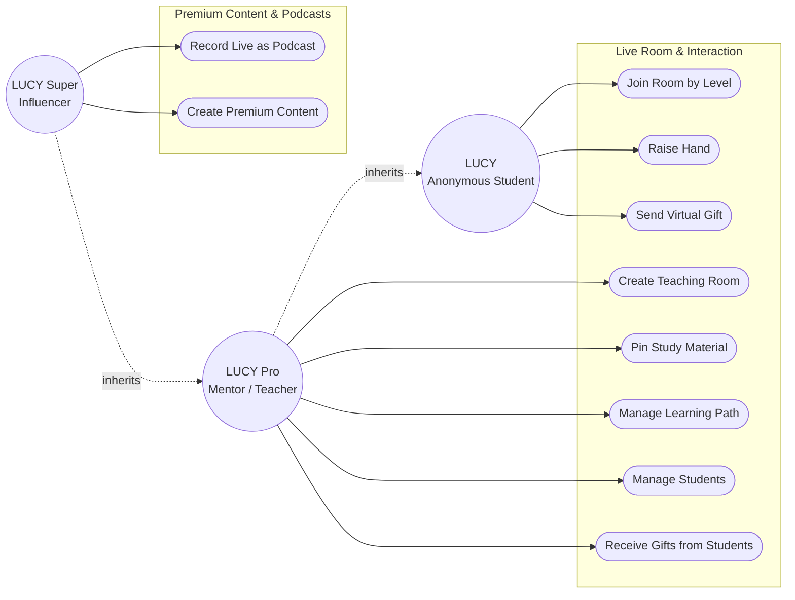

# LUCY Project - Use Case Diagram

```mermaid
flowchart LR
    %% Khai báo Actors
    Student((LUCY\nAnonymous Student))
    Mentor((LUCY Pro\nMentor / Teacher))
    Super((LUCY Super\nInfluencer))

    %% Kế thừa Actor
    Mentor -. inherits .-> Student
    Super -. inherits .-> Mentor

    %% Nhóm chức năng: Phòng học & Tương tác
    subgraph LiveRoom[Live Room & Interaction]
        direction TB
        UC_JoinRoom([Join Room by Level])
        UC_RaiseHand([Raise Hand])
        UC_SendGift([Send Virtual Gift])
        UC_CreateRoom([Create Teaching Room])
        UC_PinDoc([Pin Study Material])
        UC_ManagePath([Manage Learning Path])
        UC_ManageStudents([Manage Students])
        UC_ReceiveGift([Receive Gifts from Students])
    end

    %% Nhóm chức năng: Nội dung nâng cao
    subgraph Premium[Premium Content & Podcasts]
        direction TB
        UC_RecordPodcast([Record Live as Podcast])
        UC_CreatePremium([Create Premium Content])
    end

    %% Liên kết Actor - Use Case
    Student --> UC_JoinRoom
    Student --> UC_RaiseHand
    Student --> UC_SendGift

    Mentor --> UC_CreateRoom
    Mentor --> UC_PinDoc
    Mentor --> UC_ManagePath
    Mentor --> UC_ManageStudents
    Mentor --> UC_ReceiveGift

    Super --> UC_RecordPodcast
    Super --> UC_CreatePremium
```
